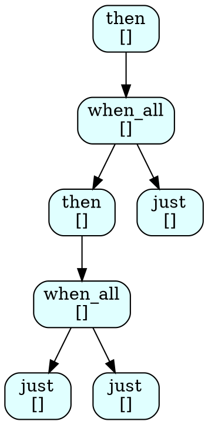

# SchemePoC: Compile-Time Scheme-Light in C++26

[](https://www.bestpractices.dev/projects/12577)

SchemePoC is a proof-of-concept **compile-time Scheme compiler and evaluator** targeting C++26 and GCC 16. It leverages the latest C++ language features (like deep `constexpr` evaluation, C++26 reflection spike, and coroutines via Beman Task) to safely parse, elaborate, and evaluate a small LISP/Scheme-like language natively at compile time.

## Architecture

The project is structured as a staged pipeline to cleanly separate parsing from semantic elaboration and evaluation:

1. **Source String**: Raw `char` sequence input.
2. **Reader (`src/smd/schemepoc/reader.hpp`)**: Parses the input string into a raw S-expression/Datum tree. It uses an arena allocator designed for `constexpr` to avoid heap persistence issues across compile-time boundaries.
3. **Elaborator (`src/smd/schemepoc/elaborator.hpp`)**: Traverses the generic datum tree to classify specific semantic Scheme forms (like literals, symbols, `if` statements, `lambda`, and applications) into a strongly typed `core_tree`.
4. **Evaluator (`src/smd/schemepoc/eval_direct.hpp`)**: Direct tree-walking evaluator representing standard synchronous execution.
5. **CPS Transformation (`src/smd/schemepoc/cps.hpp`)**: Continuation-Passing Style structural transformation, paving the way for advanced non-blocking branch flows.
6. **Closure Backend (`src/smd/schemepoc/closure_backend.hpp`)**: Compiles the CPS-transformed elements into explicitly typed C++ function closures for zero-overhead evaluation.
7. **Sender Backend (`src/smd/schemepoc/sender_backend.hpp`)**: An asynchronous compiler backend relying on C++ Execution primitives (`beman::task`) to resolve Scheme branch flows directly natively inside C++ coroutines, bypassing `variant` recursion limits.
8. **Reflection Spike (`src/smd/schemepoc/reflection_reify.hpp`)**: Demonstrates translating captured environment metadata straight into generated C++ aggregates using the experimental C++26 `std::meta` (`-freflection`).

## Example: Y Combinator Fibonacci as a Sender Graph

The Scheme source is compiled to a core tree at compile time via `compile_sender_cps`. At runtime, `eval_node` drives execution through `just`/`then`/`when_all` senders — no `beman::task` type erasure needed. The `dump_scheme_plan` utility uses C++26 reflection to visualize that sender pattern as a Graphviz DOT graph.

### Scheme Source

```scheme
((lambda (fib)
   (fib fib 5))
 (lambda (self n)
   (if (eq? n 0)
       0
       (if (eq? n 1)
           1
           (+ (self self (+ n -1))
              (self self (+ n -2)))))))
```

Compiled at compile time; evaluated at runtime via `sender_cps`:

```
fib(5) = 5
```

### Sender Execution Plan for fib(3)

The sender graph printer reflects on the static C++ sender type to produce the execution plan. For `fib(3) = fib(2) + fib(1) = (fib(1) + fib(0)) + fib(1) = 2`:

- `just` nodes are leaf values (base cases)
- `when_all` nodes evaluate their inputs in parallel
- `then` nodes sequence a continuation after its predecessor



```
         n0 [then]                ← fib(3) = fib(2) + fib(1)
              |
         n1 [when_all]            ← evaluate fib(2) and fib(1) in parallel
           /            \
      n2 [then]        n6 [just]  ← fib(1) = 1
           |
      n3 [when_all]               ← fib(2) = fib(1) + fib(0)
        /         \
   n4 [just]   n5 [just]          ← fib(1) = 1, fib(0) = 0
```

Generated by `src/examples/fibonacci_graph.cpp` using `dump_scheme_plan<Fib3>(std::cout)`.

## Build Instructions

This project requires GCC 16 to support the C++26 reflection and core constant-evaluation semantics required by the implementations.

The build system leverages CMake, the Beman project's infrastructure, and a local Python virtual environment managed by `uv`.

```bash
make          # default: build and run all tests with Asan enabled
make compile  # compile only
make test     # rebuild and run Catch2 test binaries
make ctest    # run CTest on the current build
make lint     # run pre-commit linters (clang-format, cmake, codespell, etc.)
```

## Documentation

The `docs/` folder contains deeply explored architectural documentation explaining how the compiler transitions concepts across boundaries natively:
- `docs/compiler_architecture.org`: Describes the phases from Parser through Closure Materialization.
- `docs/schemepoc-plan.md`: The initial roadmap detailing the 34 chronological steps used to achieve this repository state.
- `docs/Compile-Time Scheme-Light in C++26.md`: Preliminary research documentation that sets out the guiding philosophy of the project combining CPS, applicator parsers, and execution layers in C++26.
- `docs/constexpr-allocations.md`: Details how `constexpr_box` and Arena identifiers resolve standard `std::vector` leaks at C++ boundaries.

## Try it on Compiler Explorer (Godbolt)

You can try the direct S-expression arithmetic or lambda examples embedded within the `src/examples` code natively in GCC 16 (trunk) via [Compiler Explorer](https://godbolt.org/) instantly by copying `src/examples/godbolt_arithmetic.cpp` or `src/examples/advanced_reflection_ffi.cpp` using the `-std=c++26 -freflection` flag.

## Licensing

Code follows the Apache 2.0 license with LLVM exception.

Enjoy evaluating Scheme inside C++ templates!
