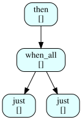
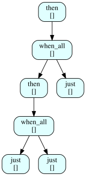

<div class="abstract" id="orgfc7c372">
<p>
By lowering my Scheme AST into heavily typed <code>std::execution</code> Senders, I gained improved performance.
Debugging it means reading thousands of lines of template backtraces.
The resulting Sender AST is a large set of deeply nested template permutations.
I project that compile-time topology out through C++26 reflection and render it as a Graphviz graph.
</p>

</div>

{{TEASER\_END}}

<nav style="margin-bottom: 2em; border-bottom: 1px solid #ccc; padding-bottom: 1em">

[↑ Series Index](index.md) | [Phase 8 - Sender-Based Evaluation ←](phase-8-senders.md)

</nav>


# The Reflection Bridge

In this phase, I use C++26 Reflection (`std::meta::info`) alongside a custom `string_writer` Applicative (McBride, Conor and Paterson, Ross, 2008) to project the generated execution typings into the Graphviz (Graphviz, 2024) dot-language for visual rendering.

C++26 Reflection (P2996) allows C++ programs to imperatively query the structural definitions of types during constant evaluation. Instead of writing recursive template metaprogramming tricks with partial specializations, I write a plain loop that interacts via `<meta>` using the `^^Sender` reflection syntax.


# The Intermediate Representation: `scheme_tree`

Before generating Graphviz output, the reflected sender topology is materialized into a homogeneous, `consteval`-friendly tree. Two types form this intermediate representation:

```cpp
/// Data describing a single node in a reflected sender execution graph.
///
/// Populated at compile time by @ref build_scheme_tree via P2996 reflection.
/// Each node corresponds to one sender in a Beman Execution26 composition
/// (e.g. @c just, @c then, @c when_all).
struct scheme_node_data {
    int node_id{}; ///< Index of this node in its @ref scheme_tree.
    std::string_view
        sender_algo{}; ///< Sender kind: "just", "then", or "when_all".
    std::string_view
        scheme_context{}; ///< Optional annotation (e.g. "Atom: 5", "Apply: +").
    foundation::static_vector<int, 8>
        child_ids{}; ///< Indices of child sender nodes.

    friend constexpr auto operator==(scheme_node_data const &,
                                     scheme_node_data const &)
        -> bool = default;
};
```

```cpp
/// A flat, index-addressed tree of @ref scheme_node_data nodes.
///
/// Nodes are allocated by @ref allocate in pre-order; child links use integer
/// indices rather than pointers so the tree is trivially copyable and can be
/// produced in a @c consteval context.
///
/// @tparam MaxNodes Maximum number of nodes (default 64).
template <int MaxNodes = 64>
struct scheme_tree {
    foundation::static_vector<scheme_node_data, MaxNodes>
        nodes{};     ///< All nodes, indexed by id.
    int root_id{-1}; ///< Index of the root node, or -1 before the root is set.

    /// Inserts @p node into the tree, assigning it the next available id.
    ///
    /// The @c node_id field of @p node is overwritten with the assigned index.
    ///
    /// @return The assigned integer index.
    constexpr auto allocate(scheme_node_data node) -> int {
        int id = static_cast<int>(nodes.size());
        node.node_id = id;
        nodes.push_back(node);
        return id;
    }

    /// Returns a const reference to the node at @p id.
    constexpr auto get(int id) const -> scheme_node_data const & {
        return nodes[id];
    }

    /// Returns a mutable reference to the node at @p id.
    constexpr auto get(int id) -> scheme_node_data & { return nodes[id]; }
};
```

This is the same flat arena pattern as the datum and core trees from Phases 3 and 4: a `static_vector` of nodes addressed by integer index, trivially copyable, and safe to produce in a `consteval` context. The difference is that the recursion depth is bounded by the sender composition depth rather than the Scheme source nesting depth.


# Building the Tree: Reflection Over Sender Types

`build_scheme_tree` populates a `scheme_tree` by walking the sender type at `consteval` time:

```cpp
/// Classifies a sender type by reading the unqualified identifier of its tag.
///
/// Beman Execution26 senders have the form
/// @c basic_sender<Tag,Data,Child...>. The tag may be a class template
/// specialisation (e.g. @c just_t<set_value_t>) or a plain class
/// (e.g. @c when_all_t); both are reduced to their unqualified identifier.
/// We dealias the sender type because P2996 reflections preserve alias
/// structure and @c template_arguments_of requires a class template
/// specialisation, not an alias.
///
/// @param type A P2996 reflection of the sender type.
/// @return One of @c "just", @c "then", @c "when_all", or @c "unknown".
consteval auto classify_sender(std::meta::info type) -> std::string_view {
    auto args = std::meta::template_arguments_of(std::meta::dealias(type));
    if (args.empty())
        return "unknown";
    auto tag = std::meta::dealias(args[0]);
    auto tag_name = std::meta::has_template_arguments(tag)
                        ? std::meta::identifier_of(std::meta::template_of(tag))
                        : std::meta::identifier_of(tag);
    if (tag_name == "just_t")
        return "just";
    if (tag_name == "then_t")
        return "then";
    if (tag_name == "when_all_t")
        return "when_all";
    return "unknown";
}

/// Recursively builds a @ref scheme_tree by reflecting on a sender type.
///
/// @c basic_sender<Tag,Data,Child...> — args[0]=Tag, args[1]=Data,
/// args[2+]=Child. P2996 reflections preserve aliases, so the sender type
/// (typically obtained via @c decltype(factory_call())) must be dealiased
/// before @c template_arguments_of will recognise it as a specialisation.
///
/// @tparam MaxNodes Maximum tree capacity (default 64).
/// @param  sender_type P2996 reflection of the sender type to traverse.
/// @param  tree        Output tree; nodes are appended in pre-order.
/// @return The integer id of the root node allocated for @p sender_type.
template <int MaxNodes = 64>
consteval auto build_scheme_tree(std::meta::info sender_type,
                                 scheme_tree<MaxNodes> &tree) -> int {
    auto type = std::meta::dealias(sender_type);
    scheme_node_data node{};
    node.sender_algo = classify_sender(type);
    auto id = tree.allocate(node);

    auto args = std::meta::template_arguments_of(type);
    for (std::size_t i = 2; i < args.size(); ++i) {
        auto child_id = build_scheme_tree<MaxNodes>(args[i], tree);
        tree.get(id).child_ids.push_back(child_id);
    }

    return id;
}
```

The traversal is straightforward: `template_arguments_of(sender_type)` yields `[Tag, Data, Child...]`, and each child at positions `[2+]` is recursed into directly.

There is one subtlety, and it is a feature of P2996 rather than a bug. Reflections preserve alias structure: when the user writes `using S = decltype(sender_v::just(42))` and reflects `^^S`, the resulting `std::meta::info` is an alias-entity reflection, not a class template specialisation. `template_arguments_of` on an alias throws, because aliases do not have template arguments — the type they *denote* does. `std::meta::dealias` peels the alias layer off and returns the underlying class template specialisation, after which `template_arguments_of` succeeds.

Classification has a parallel subtlety. The tag at `args[0]` may itself be a class template specialisation (e.g. `just_t<set_value_t>`) or a plain class (e.g. `when_all_t`). `has_template_arguments` distinguishes the two cases so we can call `template_of` + `identifier_of` when there is a primary template, and `identifier_of` directly when there is not.


# Graph Translation via Applicatives

Once I possess a homogeneous C++ tree, I turn once again to Category Theory to render the Graphviz dot-language diagram.

Using the `Applicative` typeclass from the foundation—the same typeclass that drives the `lift2` and sequencing combinators in Phase 2's parser library—I constructed a `string_writer` Applicative. The applicative and alternative interfaces allow me to map functionally over the returned string values. While the Graphviz mapping is currently driven through a simple indexing iteration, the types align allowing pure state accumulation.

```cpp
/// Renders a @ref scheme_tree as a complete Graphviz DOT graph string.
///
/// Formats each node in index order using @ref format_scheme_node and
/// wraps the result in a @c digraph block.
///
/// @tparam MaxNodes Tree capacity.
/// @param  tree The pre-built scheme tree to render.
/// @return A @c std::string containing the full DOT source.
template <int MaxNodes>
auto format_tree(scheme_tree<MaxNodes> const &tree) -> std::string {
    std::string dot = "digraph SchemeExecutionPlan {\n";
    dot += "  node [shape=Mrecord, style=filled, fillcolor=lightcyan];\n";

    for (int i = 0; i < static_cast<int>(tree.nodes.size()); ++i) {
        dot += format_scheme_node(tree.get(i)).log;
    }

    dot += "}\n";
    return dot;
}

/// Reflects on @p Sender at compile time, builds a @ref scheme_tree, then
/// emits Graphviz DOT to @p out at runtime.
///
/// The tree is built in a @c constexpr lambda so the reflection happens once
/// per @p Sender specialization.  At runtime only the string rendering runs.
///
/// Usage:
/// @code
///   using S = decltype(sender_v::then(sender_v::just(1),
///                                     [](int x){ return x + 1; }));
///   sender::dump_scheme_plan<S>(std::cout);
/// @endcode
///
/// @tparam Sender   The sender type whose execution plan is to be shown.
/// @tparam MaxNodes Maximum tree capacity (default 64).
/// @param  out      Output stream; defaults to @c std::cout.
template <typename Sender, int MaxNodes = 64>
void dump_scheme_plan(std::ostream &out = std::cout) {
    constexpr auto tree = [] {
        scheme_tree<MaxNodes> t{};
        auto root = build_scheme_tree<MaxNodes>(^^Sender, t);
        t.root_id = root;
        return t;
    }();

    out << format_tree(tree);
}
```

The `dump_scheme_plan` function encapsulates the compile-time reflection traversal into a `constexpr` lambda, cleanly executing the heavy `meta` machinery strictly during translation.


# Example Output

Running `dump_scheme_plan` on the sender type for `(+ 1 2)` — a binary addition of two constants — produces:

```
digraph SchemeExecutionPlan {
  node [shape=Mrecord, style=filled, fillcolor=lightcyan];
  n0 [label="then\n[]"];
  n0 -> n1;
  n1 [label="when_all\n[]"];
  n1 -> n2;
  n1 -> n3;
  n2 [label="just\n[]"];
  n3 [label="just\n[]"];
}
```



The structure is legible: `then` applies the addition function to the result of `when_all`, which evaluates two `just` senders (the constants 1 and 2) in parallel. This is the sender equivalent of the Scheme expression tree — branching preserved, parallelism visible.

For a more complex expression — `fib(3)`, which expands to `fib(2) + fib(1)` where `fib(2) = fib(1) + fib(0)`:

```
digraph SchemeExecutionPlan {
  node [shape=Mrecord, style=filled, fillcolor=lightcyan];
  n0 [label="then\n[]"];
  n0 -> n1;
  n1 [label="when_all\n[]"];
  n1 -> n2;
  n1 -> n6;
  n2 [label="then\n[]"];
  n2 -> n3;
  n3 [label="when_all\n[]"];
  n3 -> n4;
  n3 -> n5;
  n4 [label="just\n[]"];
  n5 [label="just\n[]"];
  n6 [label="just\n[]"];
}
```



Here the nested `when_all` makes the recursive structure visible: the left branch (`fib(2)`) decomposes into its own `when_all` of two base cases, while the right branch (`fib(1)`) is a single `just`. A thread-pool scheduler could exploit all three independent `just` evaluations simultaneously.


# Conclusion

Piping `dump_scheme_plan`'s output through `dot -Tpng -o plan.png` turns the sender tree into a picture instead of a stack of template names.

<nav style="margin-top: 3em; border-top: 1px solid #ccc; padding-top: 1em">

[↑ Series Index](index.md) | [Next: Phase 10 - Constexpr Pipeline →](phase-10-constexpr.md)

</nav>


# References

Graphviz (2024). *Graphviz DOT Language*.

McBride, Conor and Paterson, Ross (2008). *Applicative Programming with Effects*, Journal of Functional Programming.
