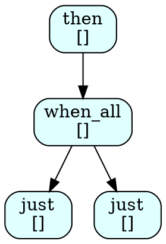

# Sender Graph Printer — Handoff Notes

This file is rewritten by each step's agent with notes for the next step.

## Current State

Step 7 is complete. All 155 tests pass (up from 151 — 4 new DumpSchemePlanTest tests:
HeaderIsIdempotent, JustSender, ThenSender, WhenAllThenSender). Linters pass.

The branch `worktree-sender-printer-step-07` contains Step 7 work built on top of Step 6.

## What Was Done in Step 7

- Created `src/smd/smdscheme/sender/dump_scheme_plan.hpp` — `format_tree` (runtime DOT
  assembly from a constexpr `scheme_tree`) and `dump_scheme_plan<Sender, MaxNodes>` (top-
  level template that reflects at compile time via `^^Sender` then streams DOT at runtime).
- Created `src/smd/smdscheme/sender/dump_scheme_plan.test.cpp` — 4 Catch2 tests covering
  `just`, `then`, and nested `then(when_all(just, just), fn)` senders.
- Updated `src/smd/smdscheme/sender/CMakeLists.txt` to add `dump_scheme_plan.hpp` to
  FILE_SET.
- clang-format also fixed minor style issues in `format_scheme_node.hpp` (const&→const &,
  std::format call reformatting) and `format_scheme_node.test.cpp` (alignment removal,
  comment spacing).

## Confirmed: constexpr + runtime pipeline works end-to-end

`^^Sender` splice WORKS on template type parameters (not consteval function parameters —
that GCC16 restriction stays). The pattern:

```cpp
template <typename Sender, int MaxNodes = 64>
void dump_scheme_plan(std::ostream& out = std::cout) {
    constexpr auto tree = [] {
        scheme_tree<MaxNodes> t{};
        auto root = build_scheme_tree<MaxNodes>(^^Sender, t);
        t.root_id = root;
        return t;
    }();
    out << format_tree(tree);
}
```

compiles and runs correctly for `just`, `then`, and `when_all` sender compositions.

## Sample DOT Output for then(when_all(just(1), just(2)), fn)



Note: `scheme_context` is empty string because `build_scheme_tree` does not populate it.
Labels show `"algo\n[]"` until a future step or the user populates `scheme_context`.

## Notes for Step 8

Begin with `step-08.md`. Step 8 creates an example program and updates documentation.

### Key facts for Step 8

- `dump_scheme_plan<SenderType>(std::cout)` is the complete public API — no setup needed.
- The sender type must be named (passed as template argument). Example usage:
  ```cpp
  #include <smd/smdscheme/sender/dump_scheme_plan.hpp>
  #include <smd/smdscheme/sender/sender_v.hpp>

  int main() {
      using S = decltype(smd::smdscheme::sender_v::then(
          smd::smdscheme::sender_v::just(42),
          [](int x){ return x * 2; }));
      smd::smdscheme::sender::dump_scheme_plan<S>(std::cout);
  }
  ```
- The example should go in `src/examples/` following the existing pattern (see
  `src/examples/godbolt_arithmetic.cpp` and similar for conventions).
- CMakeLists.txt for examples is at `src/examples/CMakeLists.txt` — add an executable
  target and a CTest test entry following existing patterns.
- Check if the examples CMakeLists already links `smdscheme.sender` (the sender examples
  do — `advanced_sender_ffi.cpp` links it). Follow the same pattern.
- Lambdas in unevaluated operands (e.g. inside `decltype(...)`) work in C++26/GCC16.
- docs update: `docs/sender_graphing.md` should be updated to reflect that the API is
  now implemented and describe usage.

### CMakeLists.txt current FILE_SET (after step 7)

```cmake
FILES
    sender_program.hpp
    sender_v.hpp
    sender_cps_program.hpp
    scheme_node_data.hpp
    scheme_tree.hpp
    build_scheme_tree.hpp
    string_writer.hpp
    format_scheme_node.hpp
    dump_scheme_plan.hpp
```
